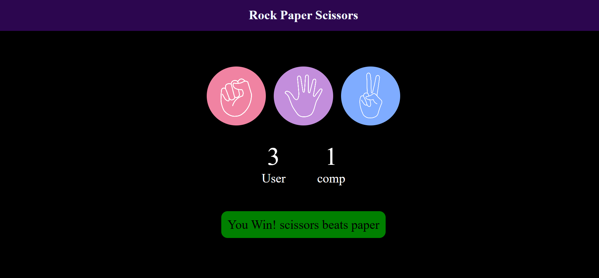

# 🪨 Rock Paper Scissors Game

A fun, interactive **Rock Paper Scissors** web game built using HTML, CSS, and JavaScript. Play against the computer, track scores in real time, and see dynamic color-coded feedback on every move!

---

## 🚀 Live Demo

👉 [Click to Play](https://rps-game-puce.vercel.app/)

---

## 📸 Screenshot

---

## ✨ Features

* **Interactive Gameplay:** Click on Rock, Paper, or Scissors to make your move.
* **Computer Opponent:** Randomized computer choices for unbiased gameplay.
* **Live Scoreboard:** Real-time updating score tracker for both user and computer.
* **Dynamic Feedback:** Status message updates dynamically with custom colors based on the outcome:
  * 🟢 **Green:** Win
  * 🔴 **Red:** Loss
  * 🔵 **Blue:** Draw

---

## 🛠️ Built With

* **HTML5:** Semantic layout containing choices, scoreboard, and message elements.
* **CSS3:** Dark-themed layout using Flexbox, hover effects, and responsive element sizing.
* **JavaScript (ES6):** Game logic, score tracking, DOM manipulation, and randomized choices.

---

\
